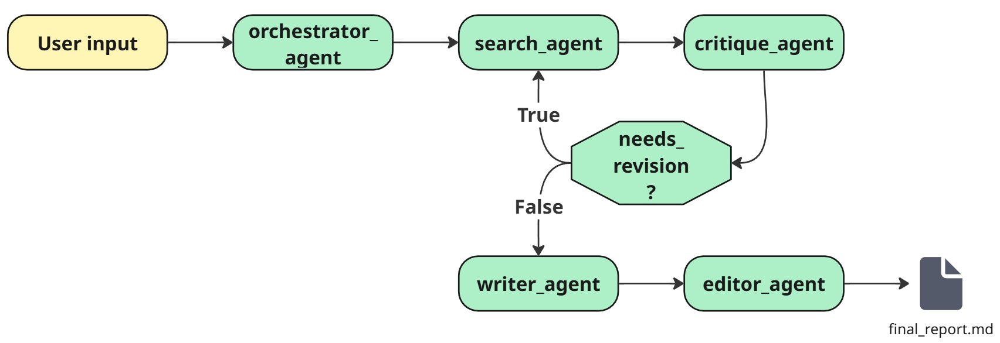

# LangGraph Research Agents

A sophisticated multi-agent research system built with LangGraph that automates comprehensive research on any topic using AI agents and web search capabilities.

## 🚀 Features

- **Multi-Agent Architecture**: Orchestrated workflow with specialized agents for different research phases
- **Automated Research Pipeline**: From topic breakdown to final report generation
- **Web Search Integration**: Real-time information gathering using Tavily Search API
- **Quality Control**: Built-in critique and revision mechanisms
- **Structured Output**: Professional markdown reports with proper citations
- **Google Gemini Integration**: Powered by Google's advanced language models

## 🏗️ Architecture


The system employs a graph-based workflow with the following specialized agents:
1. **Orchestrator Agent**: Breaks down research topics into focused questions
2. **Search Agent**: Conducts web searches and analyzes results
3. **Critique Agent**: Evaluates research quality and determines if revision is needed
4. **Writer Agent**: Transforms research findings into structured content
5. **Editor Agent**: Compiles final comprehensive reports with references

## 📋 Prerequisites

- Python 3.8+
- Google AI Studio API key ([Get one here](https://aistudio.google.com/apikey))
- Tavily Search API key ([Get one here](https://app.tavily.com/home))

## 🛠️ Installation

1. Clone the repository:
```bash
git clone https://github.com/yourusername/langgraph-research-agents.git
cd langgraph-research-agents
```
2. Install dependencies:
```bash
pip install -r requirements.txt
```
3. Set up environment variables: Create a `.env` file in the root directory:
```
GOOGLE_API_KEY=your_google_api_key_here
TAVILY_API_KEY=your_tavily_api_key_here
MODEL_NAME=gemini-2.0-flash
TEMPERATURE=1.0
```

## 🚀 Usage

Run the research agent:
```bash
python app/main.py
```
Enter your research topic when prompted, and the system will:
1. Break down the topic into research questions
2. Search for relevant information
3. Critique and refine the research
4. Generate structured content
5. Compile a final report

The final report will be saved as `output/final_report.md`.

## 📁 Project Structure

```
langgraph_research_agents/
├── app/
│   ├── agents.py          # AI agent implementations
│   ├── config.py          # Configuration and API keys
│   ├── main.py           # Main application entry point
│   ├── prompts.py        # Agent prompts and instructions
│   ├── state.py          # Research state management
│   ├── tools.py          # Web search tools
│   └── utils.py          # Utility functions
├── output/
│   └── final_report.md   # Generated research reports
├── requirements.txt      # Python dependencies
└── README.md
```

## 🔧 Configuration

The system can be configured through environment variables:
- `GOOGLE_API_KEY` : Your Google AI Studio API key
- `TAVILY_API_KEY` : Your Tavily Search API key
- `MODEL_NAME` : Google model to use (default: gemini-2.0-flash)
- `TEMPERATURE` : Model temperature for creativity (default: 1.0)

## 📊 Report Output

The system generates a comprehensive report with:
- Executive Summary
- Introduction and Context
- Main Findings with Data
- Conclusions and Implications
- Key Takeaways
- References

## 📄 License

This project is under the Apache-2.0 License.

---
*Built with ❤️ using LangGraph and Google Gemini*